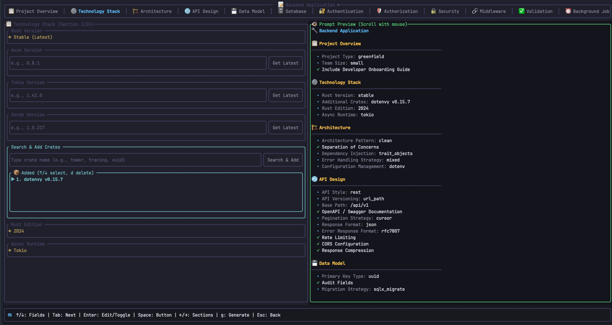

# 🥕 YERKOKU 🥕 (Prompt Generator TUI)

A powerful terminal user interface (TUI) application built with Rust and Ratatui for generating comprehensive AI development prompts from configurable JSON blueprints.




<br />


## ✨ Features

- **📋 Blueprint-Driven Forms** — Define project requirements through interactive JSON blueprints
- **🔍 Package Registry Search** — Async search on npm, crates.io, or PyPI for latest versions
- **💾 Draft System** — Auto-save and resume your work across sessions
- **👁️ Live Preview** — See your generated prompt update in real-time
- **🚀 Generate & Copy** — One-click prompt generation with clipboard support
- **📂 Combined Dashboard** — Blueprints and drafts on a single screen
- **⚠️ Exit Protection** — Confirmation dialog prevents accidental data loss
- **🎨 Beautiful TUI** — Split-screen layout with scrollable panels and styled widgets
- **📱 Multi-Platform Blueprints** — Pre-built templates for Backend, Frontend, Mobile, and Desktop
- **⚡ Async Package Search** — Non-blocking search with loading indicators
- **❌ Error Modals** — User-friendly error dialogs for all failure scenarios
- **🔧 Self-Initializing** — Default blueprints auto-install on first run

## 📸 Screens

| Screen | Description |
|--------|-------------|
| **Dashboard** | Combined view with Blueprints (left) and Drafts (right) panels |
| **Form Editor** | Split-screen with form on left, live prompt preview on right |
| **Review** | Final review before generating |
| **Success Modal** | Shows save path, clipboard status, and open-folder option |
| **Exit Confirm** | Save/Exit/Cancel dialog when leaving a form |
| **Error Modal** | Red-bordered error dialog with details |

## 🚀 Installation

### From crates.io (Recommended)

```bash
cargo install yerkoku
```

### From Source

```bash
git clone https://github.com/Milad-HajiShafiei/yerkoku.git
cd yerkoku
cargo install --path .
```

### Prerequisites

- **Terminal**: Must support true color (24-bit) and Unicode
  - ✅ Windows Terminal, iTerm2, Alacritty, Kitty, WezTerm
  - ❌ Legacy Windows CMD
- **Clipboard** (for copy feature):
  - Linux: `xclip` / `xsel` (X11) or `wl-clipboard` (Wayland)
  - macOS / Windows: Works natively

---

## 🚀 Quick Start

```bash
# Launch (blueprints auto-install on first run)
yerkoku

# Force re-install default blueprints
yerkoku --init

# Use custom blueprints directory
yerkoku --blueprints /path/to/blueprints
```

### First Launch

On first run, Yerkoku automatically installs 4 default blueprints:
- 🔧 **Backend Application** — Axum Rust with VPS deployment
- 🎨 **Frontend Application** — React with modern tooling
- 📱 **Mobile Application** — React Native with Expo
- 🖥️ **Desktop Application** — Slint with Rust

### Workflow

1. **Dashboard** → Select a blueprint or resume a draft
2. **Fill Form** → Navigate sections, fill fields, search packages
3. **Preview** → Watch the right panel update live
4. **Generate** → Press `g` or the Generate button
5. **Success** → Prompt saved to file + copied to clipboard

---

## 📂 Where Are Files Stored?

| OS | Base Directory |
|----|----------------|
| **Linux** | `~/.local/share/yerkoku/` |
| **macOS** | `~/Library/Application Support/yerkoku/` |
| **Windows** | `C:\Users\<Username>\AppData\Roaming\yerkoku\` |

```
yerkoku/
├── blueprints/          # JSON blueprint templates (auto-installed)
│   ├── backend.json
│   ├── frontend.json
│   ├── mobile.json
│   └── desktop.json
├── drafts/              # Saved form states
└── prompts/             # Generated prompt files (.md)
```

Override with environment variables:
```bash
BLUEPRINTS_DIR=/custom/path yerkoku
DRAFTS_DIR=/custom/path yerkoku
```

---

## ⌨️ Keyboard Shortcuts

### Dashboard (Combined Blueprints + Drafts)

| Key | Action |
|-----|--------|
| `↑` / `↓` | Navigate within focused panel |
| `Tab` / `→` | Focus Drafts panel |
| `Shift+Tab` / `←` | Focus Blueprints panel |
| `Enter` | Select blueprint / Open draft |
| `d` | Delete selected draft (Drafts panel) |
| `n` | Switch to Blueprints panel |
| `r` | Refresh both lists |
| `q` / `Esc` | Quit |

### Form Editor

| Key | Action |
|-----|--------|
| `↑` / `↓` / `k` / `j` | Navigate fields |
| `Tab` | Next field / Sub-navigation in composite widgets |
| `Shift+Tab` | Previous field |
| `Enter` | Edit text / Toggle checkbox / Cycle select / Toggle multiselect |
| `Space` | Activate button / Toggle checkbox / Toggle multiselect |
| `←` / `→` / `n` / `p` | Switch sections |
| `e` | Start editing current field |
| `g` | Generate prompt and quit |
| `s` | Save draft |
| `r` | Review screen |
| `d` / `Delete` | Delete item in focused list |
| `PageUp` / `PageDown` | Scroll form |
| `q` / `Esc` | Exit (shows confirmation dialog) |
| `Ctrl+C` | Force quit (auto-saves) |
| `Ctrl+S` | Generate and quit |

### Composite Widgets (CrateInput, CrateSearch, ListBuilder)

| Key | Action |
|-----|--------|
| `Tab` | Cycle: Input → Button → List → Next field |
| `Shift+Tab` | Cycle backward |
| `Enter` (on input) | Start editing |
| `Enter` (on button) | Trigger action (search/add) |
| `↑` / `↓` (on list) | Navigate list items |
| `d` / `Delete` (on list) | Remove selected item |

### MultiSelect Widget

| Key | Action |
|-----|--------|
| `↑` / `↓` | Navigate options |
| `Enter` / `Space` | Toggle option at cursor |
| `Tab` | Move to next field |

### Exit Confirmation Dialog

| Key | Action |
|-----|--------|
| `↑` / `↓` | Navigate options |
| `Enter` / `Space` | Select highlighted option |
| `s` | Save & Exit (shortcut) |
| `x` | Exit without saving (shortcut) |
| `Esc` | Cancel and return to form |

### Success Modal

| Key | Action |
|-----|--------|
| `Enter` / `Esc` / `Space` | Return to form |
| `o` | Open prompts directory in file manager |
| `m` | Go to dashboard |
| `q` | Quit |

### Error Modal

| Key | Action |
|-----|--------|
| `Enter` / `Esc` / `Space` | Dismiss error |

## 🖱️ Mouse Controls

| Action | Area | Effect |
|--------|------|--------|
| **Scroll** | Preview (right) | Scroll prompt preview |

---

## 🔍 Package Registry Search

Search for the latest package versions directly within the form:

| Registry | Blueprint Field | Searches |
|----------|----------------|----------|
| `npm` | `"registry": "npm"` | npmjs.com |
| `crates.io` | `"registry": "crates.io"` | crates.io |
| `pypi` | `"registry": "pypi"` | pypi.org |

**How it works:**
1. Navigate to a "Search & Add" field
2. Type a package name (e.g., `axios`, `tokio`, `flask`)
3. Press `Tab` to focus the Search button
4. Press `Enter` to search (async — UI stays responsive)
5. Latest version is added to the list automatically

---

## 🛠️ CLI Commands

```bash
yerkoku                    # Launch application
yerkoku --init             # Force re-install default blueprints
yerkoku --blueprints PATH  # Use custom blueprints directory
yerkoku --help             # Show help
yerkoku --version          # Show version
```

---

## 🎨 Custom Blueprints

Create your own blueprint templates:

```bash
# Navigate to blueprints directory
cd ~/.local/share/yerkoku/blueprints

# Create a new blueprint
touch my_project.json
```

### Blueprint Structure

```json
{
  "name": "My Custom Project",
  "description": "What this blueprint generates",
  "icon": "🎯",
  "sections": [
    {
      "title": "Section Name",
      "icon": "📋",
      "description": "Section description",
      "fields": [
        {
          "key": "unique.field.key",
          "label": "Display Label",
          "type": "text",
          "placeholder": "Hint text",
          "required": false,
          "default": ""
        }
      ]
    }
  ]
}
```

### Available Field Types

| Type | Widget | Description |
|------|--------|-------------|
| `text` | TextInput | Single-line text input |
| `textarea` | TextInput (multiline) | Multi-line text with word wrap |
| `checkbox` | Checkbox | Boolean toggle |
| `select` | Select | Single choice dropdown |
| `multiselect` | MultiSelect | Multiple choice with ☑/☐ checkboxes |
| `crate_input` | CrateInput | Package version with "Get Latest" button |
| `crate_search` | CrateSearch | Search & add packages from a registry |
| `list_builder` | ListBuilder | Add/remove items with internal scrolling |
| `action_button` | Button | Trigger an action (centered, no border) |
| `section_break` | None | Visual separator |

### Field Properties

| Property | Type | Description |
|----------|------|-------------|
| `key` | string | Unique field identifier |
| `label` | string | Display label |
| `type` | string | Field type (see above) |
| `placeholder` | string | Hint text for inputs |
| `description` | string | Help text |
| `required` | bool | Mark as required |
| `default` | any | Default value |
| `hidden` | bool | Hide from form (still in data) |
| `options` | array | Options for select/multiselect |
| `registry` | string | Package registry (`npm`, `crates.io`, `pypi`) |
| `crate_name` | string | Package name for crate_input |
| `target_list_key` | string | Key where crate_search adds items |
| `button_text` | string | Text for action_button |
| `action` | string | Action identifier (`generate_copy`, `generate_only`) |

---

## 🐛 Troubleshooting

### Blueprints not showing

```bash
yerkoku --init
ls ~/.local/share/yerkoku/blueprints/
```

### Clipboard not working

- **Linux (X11)**: `sudo apt install xclip`
- **Linux (Wayland)**: `sudo apt install wl-clipboard`
- **macOS / Windows**: Should work natively

### Package search fails

- Check internet connectivity
- Verify package name spelling
- Test manually: `curl -s https://registry.npmjs.org/axios | jq '."dist-tags".latest'`

### Terminal rendering issues

- Ensure true color support (24-bit)
- Ensure Unicode support
- Minimum terminal size: 80×24

---

## 🤝 Contributing

1. Fork the repository
2. Create a feature branch (`git checkout -b feature/amazing-feature`)
3. Commit using [Conventional Commits](https://www.conventionalcommits.org/)
4. Push and open a Pull Request

### Building from Source

```bash
git clone https://github.com/Milad-HajiShafiei/yerkoku.git
cd yerkoku
cargo build --release
./target/release/yerkoku
```

---

## 📄 License

MIT License — see [LICENSE](LICENSE) for details.

## 🙏 Acknowledgments

- [Ratatui](https://ratatui.rs/) — Terminal UI framework
- [Crossterm](https://github.com/crossterm-rs/crossterm) — Terminal manipulation
- [arboard](https://github.com/1Password/arboard) — Clipboard access
- [reqwest](https://github.com/seanmonstar/reqwest) — HTTP client
- [clap](https://github.com/clap-rs/clap) — CLI argument parsing
- [dirs](https://github.com/dirs-dev/dirs-rs) — OS-specific directories

---

**Built with ❤️ and 🦀 Rust**
